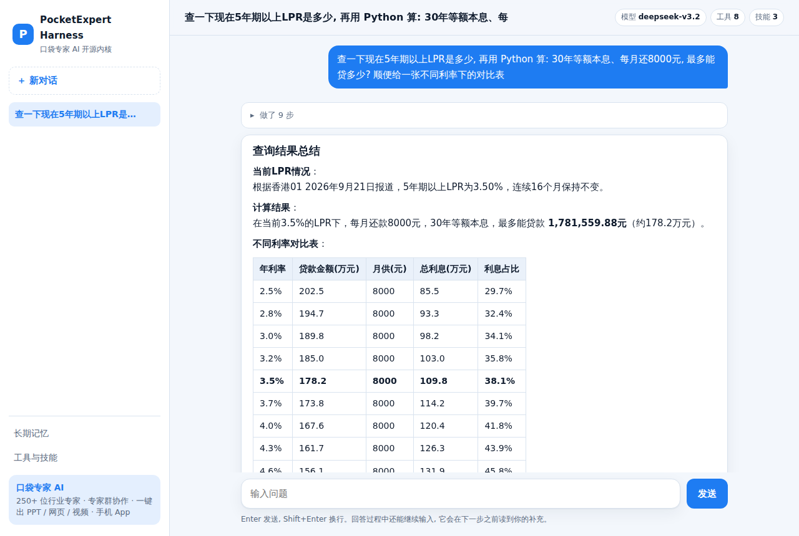

# PocketExpertHarness

**The open-core agent harness behind PocketExpert AI (口袋专家 AI).** An assistant that decides its own next step — search, read pages, run code, read and write files, call MCP tools and skills — until the job is done.

> **Try it online, no signup:** <https://agentsdance.ai>
>
> **On your phone:** get Pocket Expert AI for iPhone / iPad on the [App Store](https://apps.apple.com/app/%E5%8F%A3%E8%A2%8B%E4%B8%93%E5%AE%B6ai/id6801482441). Android, the WeChat Mini Program and desktop apps are on the [download page](https://agentsdance.ai/download).
>
> [中文](README.md)



## Why this one

- **Same engine as production.** `pocketexpert_harness/kernel/` is exported verbatim from the turn driver that runs PocketExpert AI in production every day. It is not a separate demo.
- **The model decides the next step.** No intent classifier, no hard-coded pipeline. The kernel only owns the loop: inbox, session log, context compaction, retries, stuck detection and wrap-up.
- **Steer it mid-run.** Keep typing while it works; your note is picked up before the next step.
- **Works well in mainland China.** Presets for DeepSeek, Qwen (DashScope) and SiliconFlow; the web UI loads no foreign CDN or fonts; a bundled SearXNG gives free web search.
- **MCP, skills and long-term memory built in.** MCP config uses the Claude Desktop format; skills use SKILL.md; memory is two files you can edit.

## Quick start

### Docker (recommended, includes web search)

```bash
git clone https://github.com/AgentsDanceAI/PocketExpertHarness.git
cd PocketExpertHarness
cp .env.example .env        # set PEH_PROVIDER and LLM_API_KEY
docker compose up -d
```

Open <http://127.0.0.1:8080>. Sessions, memory and workspace files live in `./data`.

### Local (Python 3.10+)

```bash
pip install -e .
export PEH_PROVIDER=deepseek LLM_API_KEY=sk-...
peh                   # terminal chat
peh serve             # web chat at http://127.0.0.1:8080
peh run "one-shot question"
peh doctor            # check model, search and MCP config
```

For web search when running locally, set one of `SEARXNG_URL`, `TAVILY_API_KEY` or `BRAVE_API_KEY`.

## Models

Any OpenAI-compatible `/chat/completions` endpoint with tool calling works. Presets: `deepseek`, `qwen`, `siliconflow`, `openai`, `openrouter`, `ollama`. Override with `LLM_MODEL` and `LLM_BASE_URL`.

## Tools

`web_search`, `open_url` (blocks private and metadata addresses), `list_files` / `read_file` / `write_file` (confined to the workspace), `run_python` (`PEH_PYTHON=on|ask|off`), `use_skill`, `remember`, and `mcp__<server>__<tool>` for every connected MCP server.

## MCP

Put servers in `config/mcp.json` (Docker) or `./mcp.json` (local), Claude Desktop format. stdio and Streamable HTTP are supported; `${ENV}` references are expanded. stdio servers only inherit basic variables such as PATH and HOME plus the `env` you set, never the model API key.

## Skills

One directory per skill with a `SKILL.md` (name, description, optional `triggers`). The prompt lists names and descriptions; the model reads full instructions with `use_skill`. When the user's message hits a trigger word, the skill is loaded automatically before the first step.

## Long-term memory

`soul.md` (hand-written identity and preferences, included every turn) and `memories.json` (points the agent was asked to remember). Lines that look like prompt injection are stripped on write, and memory is injected as clearly labeled background.

## Use it from code

```python
import asyncio
from pocketexpert_harness.agent import Harness
from pocketexpert_harness.config import Settings

async def main():
    h = await Harness(Settings.from_env()).start()
    async for ev in h.run_turn([], "Introduce yourself in one sentence"):
        if ev["event"] == "done":
            print(ev["answer"])
    await h.close()

asyncio.run(main())
```

The kernel has exactly three ports: call the model, run a tool, assemble the system prompt. The rest of this repository is one implementation of those ports; swap any of them.

## Events

`assistant_delta`, `step`, `observation`, `steer`, `notice`, `done`. The web API streams the same events over SSE at `POST /api/sessions/{id}/messages`; steer with `POST /api/sessions/{id}/steer`, stop with `POST /api/sessions/{id}/stop`.

## Security notes

- `run_python` is **not a sandbox**. Locally it runs model-written code on your machine; the CLI asks first by default and the web server enables it only inside a container. Secrets in the environment are not passed to the child process.
- The web server binds to 127.0.0.1 and refuses to listen publicly unless `PEH_ACCESS_TOKEN` is set.
- See [SECURITY.md](SECURITY.md) to report a vulnerability.

## PocketExpert AI

This repository is the kernel. The full product at [agentsdance.ai](https://agentsdance.ai) adds 250+ domain experts, multi-expert groups, an understanding layer and layered prompts, one-click slides / web pages / videos, and ready-to-use apps with no model setup: web, [iPhone / iPad](https://apps.apple.com/app/%E5%8F%A3%E8%A2%8B%E4%B8%93%E5%AE%B6ai/id6801482441), Android, the WeChat Mini Program and desktop, all on one account.

## Contributing

See [CONTRIBUTING.md](CONTRIBUTING.md). `kernel/` is exported from upstream; please open an issue instead of editing it here.

## License

[Apache License 2.0](LICENSE)
