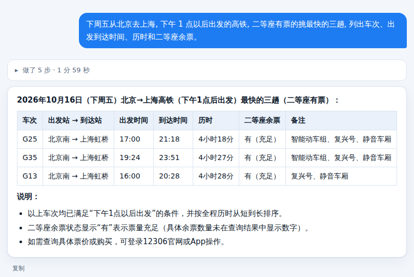
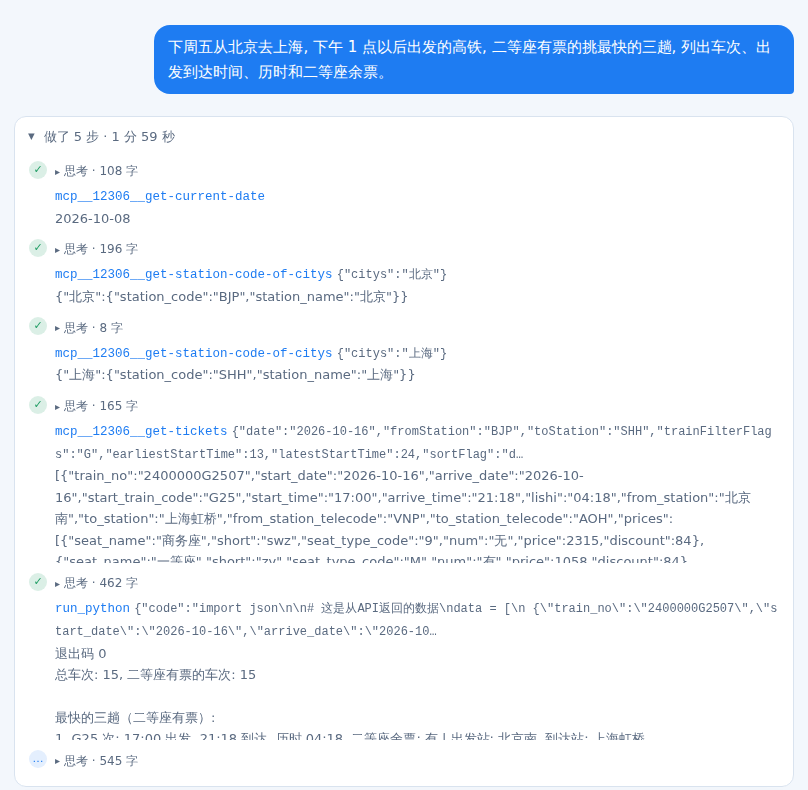

# 12306 查火车票

[English](README.en.md)

用一句话问火车票：余票、中转方案、经停站，查的都是 12306 的**实时数据**。

接的是开源的 [12306-mcp](https://github.com/Joooook/12306-mcp)（MIT），和[口袋专家 AI](https://agentsdance.ai) 旅行专家「查火车票」用的是同一个后台。PocketExpertHarness 一行代码都不用改，配一个 MCP 就行。

## 它是怎么查出来的

上面那一问，它自己走了 5 步，每一步先想再动手：先查今天几号（算出「下周五」是 10 月 16 日），再把「北京」「上海」换成车站代码，然后查余票，最后用 Python 按出发时间和历时筛选、排序。

## 自己跑一遍

1. 需要 Node.js 18 以上（有 `npx` 命令）。用 Docker 跑的话镜像里已经自带。
2. 把 [mcp.json](mcp.json) 放好：
   - 本机：复制到你运行 `peh` 的目录下（或设 `PEH_MCP_CONFIG=它的路径`）
   - Docker：复制成 `config/mcp.json`，再 `docker compose restart`
3. 跑 `peh doctor`，看到 `✓ MCP 12306: 8 个工具` 就接好了。第一次会下载 12306-mcp，约半分钟。
4. 在网页或终端里直接问，比如：

   - 下周五从北京去上海，下午 1 点以后出发的高铁，二等座有票的挑最快的三趟，列出车次、出发到达时间、历时和二等座余票。
   - 明天从杭州去西安，没有合适直达的话给我两个中转方案，写清在哪换乘、换乘等多久、总历时。
   - G25 次列车经停哪些站？几点到南京南？

   命令行一问一答：`peh run "G25 次列车经停哪些站？几点到南京南？"`

`mcp.json` 里的 `npm_config_registry` 让 `npx` 从国内镜像下载，海外网络可以删掉这一行。

## 实测

2026-10-08，百炼 `deepseek-v3.2`，开着思考：

| 问题 | 用时 | 步数 |
|---|---|---|
| 下周五北京→上海，下午最快的三趟（网页） | 1 分 59 秒 | 5 |
| 同一类问题，指定日期（命令行） | 37 秒 | 3 |
| 杭州→西安的中转方案 | 1 分 38 秒 | — |
| G25 经停站 | 25 秒 | 2 |

中转那一问，它给了两个方案之后还主动指出：这条线其实有直达车，比中转更快。

## 要知道的

- **只能查，不能买。** 下单请用 12306 App 或官网 12306.cn。它不登录、不碰验证码、不抢票。
- **余票随时在变。** 同一个问题隔一会儿再问，结果可能不同，以 12306 购票页为准。
- 换别的模型也行，只要支持工具调用；模型越强，筛选和排序越稳。
