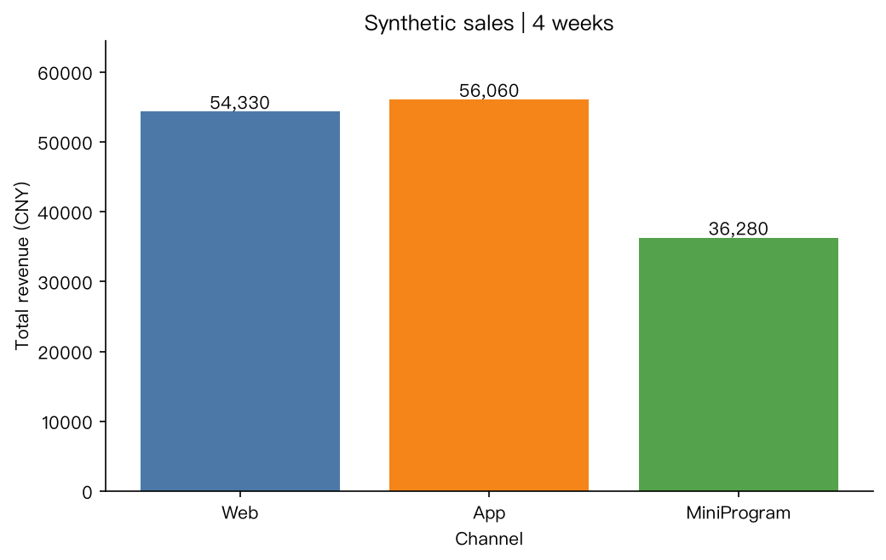

# CSV → 汇总表、图表、中文报告

[English](README.en.md)

一个可以自己复算的 PocketExpertHarness 示例。输入是 **12 行合成销售数据**，不是客户数据或真实业务收入。



## 输入和交付物

- [sales.csv](sales.csv)：4 周 × 3 个渠道，包含订单数和收入。
- [prompt.txt](prompt.txt)：参考运行使用的完整提示词。
- [reference/summary.csv](reference/summary.csv)、[reference/revenue.png](reference/revenue.png)、[reference/report.md](reference/report.md)：一次真实运行的输出，用于比较。模型可能给出不同的文字和样式。

## 自己跑一遍

从仓库根目录执行。先按主 README 安装 `pocketexpert-harness`，配置支持工具调用的模型；本例不需要联网搜索，也不需要 pandas。

```bash
# 模型示例；换成你已经配置好的兼容服务也可以。
export PEH_PROVIDER=deepseek
export LLM_API_KEY=你的模型Key

mkdir -p workspace/sales-example
cp examples/sales-report/sales.csv workspace/sales-example/sales.csv

PEH_HOME="$PWD/data/sales-example" \
PEH_WORKSPACE="$PWD/workspace/sales-example" \
PEH_PYTHON=ask \
peh run "$(cat examples/sales-report/prompt.txt)"
```

命令行会在执行模型写出的 Python 前询问，先检查代码再确认。Python 工具不是安全沙箱；也可以在隔离容器里运行本例。使用远程模型时，任务数据会发送到你配置的服务。

完成后查看 `workspace/sales-example/` 下的三个文件。网络延迟、模型和任务执行路径都会影响耗时，不保证一次运行成功。

## 独立核对数字

本例的正确总计是 **478 笔订单、146,670 元合成收入**。合计客单价应按总收入除以总订单数计算，不是三个渠道客单价的简单平均。

| 渠道 | 订单 | 合成收入 / CNY | 客单价 / CNY |
|---|---:|---:|---:|
| Web | 175 | 54,330 | 310.46 |
| App | 172 | 56,060 | 325.93 |
| MiniProgram | 131 | 36,280 | 276.95 |
| TOTAL | 478 | 146,670 | 306.84 |

下面的标准库脚本从原始输入重新计算，再与**你这次生成的**汇总表比较：

```bash
python - <<'PY'
import csv
from decimal import Decimal, ROUND_HALF_UP
from pathlib import Path

source = Path('examples/sales-report/sales.csv')
output = Path('workspace/sales-example/summary.csv')
expected = {}
with source.open(newline='') as f:
    for row in csv.DictReader(f):
        group = expected.setdefault(row['channel'], [0, Decimal(0)])
        group[0] += int(row['orders'])
        group[1] += Decimal(row['revenue_cny'])
expected['TOTAL'] = [sum(x[0] for x in expected.values()),
                     sum(x[1] for x in expected.values())]
with output.open(newline='') as f:
    rows = list(csv.DictReader(f))
assert len(rows) == len(expected), 'Unexpected or duplicate summary rows'
assert {r['channel'] for r in rows} == set(expected), 'Missing or extra channels'
for row in rows:
    orders, revenue = expected[row['channel']]
    average = (revenue / orders).quantize(Decimal('.01'), rounding=ROUND_HALF_UP)
    assert Decimal(row['orders']) == orders, row
    assert Decimal(row['revenue_cny']) == revenue, row
    assert Decimal(row['average_order_value_cny']) == average, row
print('PASS: all totals and weighted averages match the input')
PY
```

## 参考运行条件

2026-09-30，PocketExpertHarness 0.2.0，兼容接口配置的模型 ID 为 `deepseek-v4.1-flash`，Python 工具开启，未接 MCP 或搜索服务。单次回合用时约 69 秒。这个记录只说明该配置完成了这个小样本，不能当成性能基准或真实经营效果。

参考输出已通过上面的数值口径独立复核。柱状图为实际产出；不要把合成数据中的增长率解释为产品带来的收益。

想直接使用配置好的专家，可以体验 [口袋专家 AI](https://agentsdance.ai/?utm_source=github&utm_medium=example&utm_campaign=peh-organic-20260930&utm_content=csv-report)。它与开源版共用内核，功能范围和运行环境不同。
